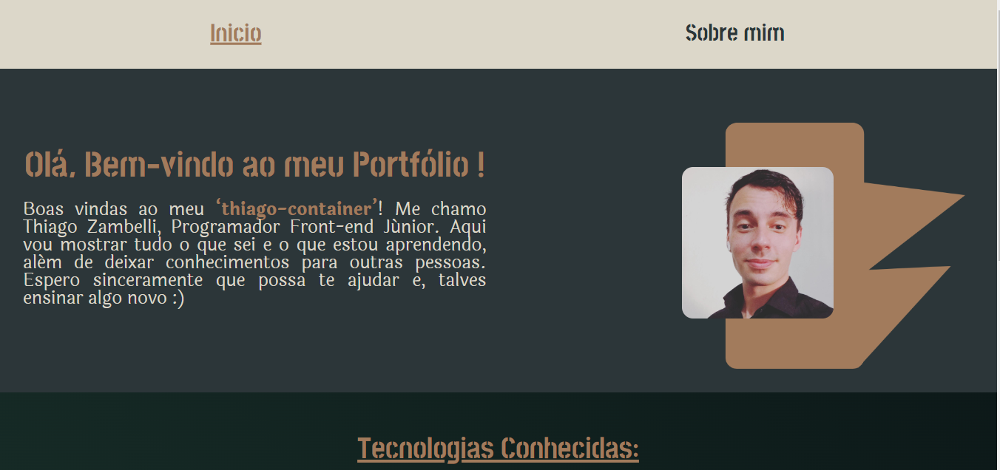

 
 

 
 <h1 align="left">Bem-Vindo ao Projeto -> Meu Portfolio </h1>
 <h2 align="left">Feito por : Thiago Zambelli</h2>
 
  

&nbsp;

&nbsp;

### Card Flip das `Tecnologias Conhecidas`

> A propriedade `perspective` indica a profundidade do container, ou o quao longe o objeto está do usuario

> A propriedade `backface-visibility` ocultara o verso do casrtao

> A propriedade `trasform-style` especifica como os elementos aninhados são resnderizados no espaço 3D

~~~html
    

        

        

    

~~~

- ### Cria o container e o card para o efeito
~~~css
    .container{
         height: 400px;
        width: 220px;
        perspective: 1000px;    
        background-color: transparent;
    }

    .front, .back{
        position: absolute;
        backface-visibility: hidden;
        transform-style: preserve-3d;
        transition: all 1s ease;
        width: 100%;
        height: 100%;
    }
~~~

- ### Adiciona o movimento com o passar do mouse ou com o clicar

~~~css
    .container:hover .front{
    transform: rotatey(-180deg);
    }

    .container:hover .back{
        transform: rotatey(0deg);
    }

    .container2:active .front{
        transform: rotatey(-180deg);
    }

    .container2:active .back{
        transform: rotatey(0deg);
    }
~~~

---

&nbsp;

- ### Config para utilização do `absolut import do React`:

&nbsp;

 > Consisite em um arquivo JSON na rais do projeto que possibilita os absolut import
~~~JSON
{
    "compilerOptions": {
        "baseUrl": "src"
    },
    "include": ["src"]
}
~~~

&nbsp;

---

&nbsp;

- ### Rotas dentro de rotas:

&nbsp;

 > Foi utilizado uma rota como `Pagina padrao` qu abrigou dentro de si as demais rotas, para que não houvesse repetição de codigo

 &nbsp;

 

~~~JavaScript

          //Neste caso o ´<PaginaPadrao />´  esta carregando todos os componentes que sao iguais a todas as rotas
          <Route path="/" element={<PaginaPadrao />}>
            <Route path="/" element={<Inicio />} />
            <Route path="/sobremim" element={<SobreMim />} />
          </Route>

          // E dentro dela retorna uma ´<main>´ com o banner o rodape e <Outlet /> que porsua vez carrega a rota atual
  <main>
    <Banner />
    <Outlet />
    <Rodape />
  </main>
~~~